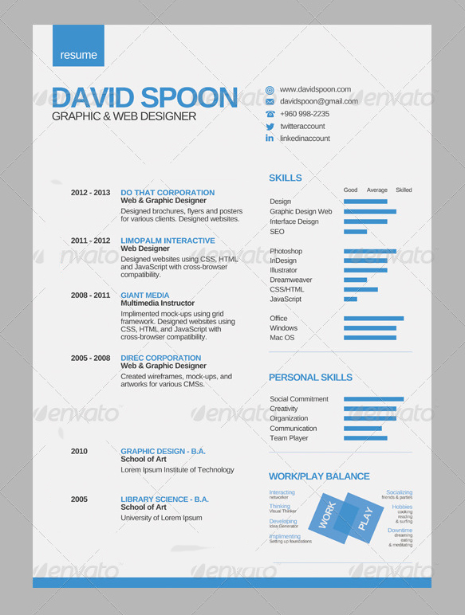

# Training day n°3: Tables

## Instructions

You will create a resume based on the template you will find below the instructions.

**WARNING**:
1. Use only **TABLES** for layout (Ability to nest tables)
2. For icons, use the **Font Awesome Icons** (An opportunity to learn how they work)
3. Use CSS for formatting text and colors. (body color: #b7b7b7, color sheet: # f1f1f1)
4. Create 3 DIVs
    * Put "Resume" in Div 1
    * "Work" in div 2
    * "Play" in div 3
5. Position the 3 div as shown in the template (see positioning in CSS)
6. For the police, use **Arial, Helvetica or sans-serif**.
7. For small progress bars, use *progress or meter* tags
8. Here are the table tags: *Table, thead, tbody, tfoot, tr, td ...*


## Voici le gabarit


## HTML Tableaux
```html
<table>
   <tr>
      <td>Dad</td>
      <td>Mom</td>
      <td>Son</td>
      <td>Girls</td>
   </tr>
</table>
```
## TIP
Start by learning the TABLE tag and its children before you start the exercise, this will save you a lot of time.
Same for Front Awesome Icons. As we saw the other time on *the joys of code* Read the documentation is IMPORTANT

## Resources

1. [Font Awesome Icons](http://fontawesome.io/icons/)
2. [What fonts to use on the Web?](https://www.alsacreations.com/article/lire/631-quelles-polices-pour-un-site-web.html)
3. [HTML Table Example](https://www.w3schools.com/html/html_tables.asp)
4. [Balises Progress et Meter](https://developer.mozilla.org/fr/docs/Web/HTML/Element/Progress)
5. [Guide de survie du positionnement CSS](https://www.alsacreations.com/article/lire/53-GuidedesurviedupositionnementCSS.html)
6. [Initiation au positionnement CSS : 3](https://openweb.eu.org/articles/initiation_absolue)

# Have fun
