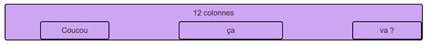
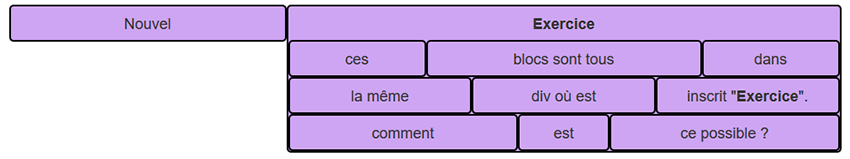
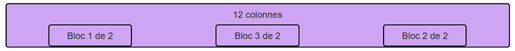
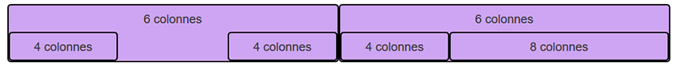

# Bootstrap - Exercises to understand the grid

## Exercice 1 : block positioning

Use Bootstrap to get the following layout :

## Exercice 2 : Nested elements

Use Bootstrap to get the following layout :

## Exercice 3 : change the order of the elements

Use Bootstrap to get the following layout :

## Exercice 4 : Another last one

Use Bootstrap to get the following layout :

