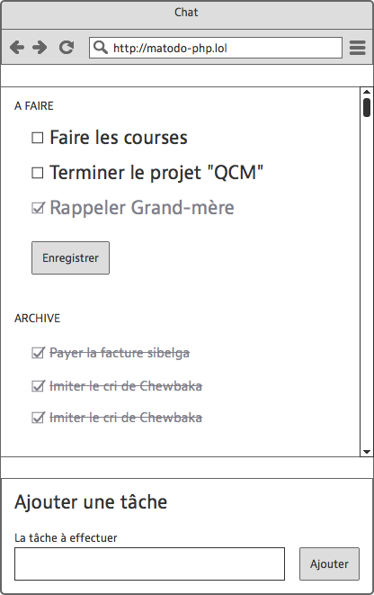

# To-do list, in php

In teams of 2 aka Pair-gramming!

| Teams                 |
| ----------------------|
| Alexandre - Dayvid    |
| Aron - Quentin        |
| Prince - Sarah        |
| Bertrand - Daria      |
| Zakaria - Ayoub       |
| Simon - Valérian      |
| Flaviano - Imad       |
| Mario - Michaël       |
| Thijs - Jimmy         |
| Thomas - Maxime       |
| Nicolay - Tsinxias    |

"Pair programming is an agile software development technique in which two programmers work together at one workstation. One, the driver, writes code while the other, the observer or navigator, reviews each line of code as it is typed in. The two programmers switch roles frequently."

## Specs
- name of the repository : `todolist`
- deploy your app on heroku so it's online for us to test
- send your repository's url + heroku via ryver
- do not forget to add a quality readme where you pinpoint who was the team, who did what, and other information you find important to share.

## Deadline
4 days.

Create a basic and reliable task management tool. It contains two screens :

- screen 1 : a small form allowing to add a todo-item (a "textarea" field and "submit" button).
- screen 2 : the list of tasks to do, each task has to have a checkbox. When a task is performed, the task is ticked and a "Save" button is pressed which refreshes the list by deleting the completed task and putting it in the "Archived" area.

## Main objective

- "form.php" file : When we submit a form it has to, after sanitizing and validating the input, save the tasks in a JSON format in a TXT file ( for example `todo.json` )
- "content.php" file : Reads the content of the json file, displays each entry in the appropriate section ("Todo" or "Archived") with the neccesary html to make a checkbox.

## Bonus
- With Javascript, hide the "Save" button and save the last with ajax when a checkbox's state (selected/unselected) changes.
- With Javascript, re-ordering the tasks vertically, with drag and drop.

## What's new

- the JSON format ([documentation](https://www.alsacreations.com/article/lire/1675-json-stockage-leger-pratique-donnees-multitypes.html))
- a function to read and write the contents of a file: [`file()`](http://php.net/manual/en/function.file.php) et [`file_put_contents`](http://php.net/manual/en/function.file-put-contents.php)
- a function to manipulate content into JSON format [`json_encode()`](http://php.net/manual/en/function.json-encode.php) et [`json_decode()`](http://php.net/manual/en/function.json-decode.php)

## What you already know
- arrays
- loops
- conditions
- What is a function and how to use it

## Planning
Here is a realistic planning you should be able to reach at the end of each day.

### Day 1
- Having created your repo and local directory
- Having read and understood the [documentation](https://www.alsacreations.com/article/lire/1675-json-stockage-leger-pratique-donnees-multitypes.html) on the JSON format
- Having identified the neccesary files and created them (empty at first)
- Sanitizing and validating the input on form submit of a new task
- Writing a task in the `todo.json` file.
- Having commited your progress, latest at the end of the day.

### Day 2
- Reading contents of the `todo.json` file
- Display the tasks in the 2 content sections (Todo/Archived) approriately.
- Having commited your progress, latest at the end of the day.

### Day 3
- The "content.php" file displays the newly added task on submit.
- Having commited your progress, latest at the end of the day.

### Day 4
- Create a "Bonus" branch
- Complete the bonus objectives
- If OK, merge it with the "Master" branch

### Day 5
Submit
